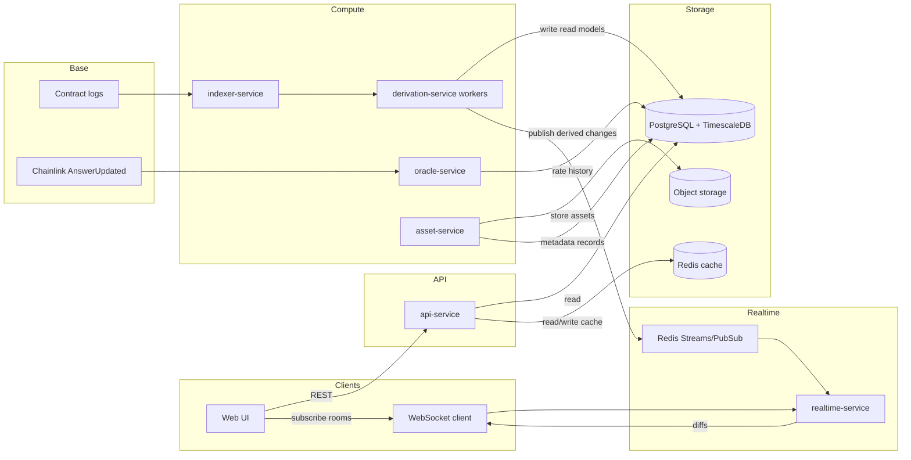

# High-Level Architecture — Token Launch & Trading Platform (Base)

Primary reference: [`PRD.md`](../PRD.md)

## Goals

- **Realtime UI updates within 2 seconds** after on-chain trades and transfers
- **Fast pagination** for high-cardinality lists (holders, trades, activity, positions)
- **Correct analytics** (OHLCV candles, WAC cost basis, royalties) with reorg-safe indexing
- **Scales to** 15,000+ tokens and 5,000+ concurrent WebSocket connections

## Architecture overview

This backend is built around two pipelines:

- **Index + derive (source of truth → read models)**: ingest Base logs, normalize into canonical event rows, and deterministically derive the read models required by the PRD.
- **Realtime delivery (read-model diffs → rooms)**: publish small “derived change events” and push them to WebSocket rooms aligned to UI views.

## Services and responsibilities

### `indexer-service`

**Responsibility**: Ingest Base chain logs and persist normalized canonical events with reorg safety and idempotency.

**Inputs**
- Base RPC(s): `eth_getLogs`, block timestamps, transaction receipts (when needed)
- Contract ABIs and tracked contract addresses (from PRD list)

**Outputs**
- Canonical “normalized event” tables (e.g., swaps, transfers, fee distributions, pool state updates, launches, ownership changes)
- A checkpoint of indexed blocks and safety depth

**Correctness rules**
- Idempotent writes keyed by `(chain_id, tx_hash, log_index)`
- Reorg strategy:
  - index to a confirmation depth (configurable)
  - keep the ability to replay last N blocks deterministically from canonical events

### `oracle-service`

**Responsibility**: Ingest Chainlink ETH/USD `AnswerUpdated` events and persist rate history used for USD conversions.

**Outputs**
- ETH/USD rate history table (block/time indexed)

### `derivation-service` (workers)

**Responsibility**: Consume canonical normalized events and maintain derived read models used by APIs and WebSocket diffs.

**Derived read models (PRD coverage)**
- **Token discovery/homepage**
  - current price + market cap (ETH + USD)
  - 24h volume + price change %
  - holder count
  - lifetime trading fees
  - fee receiver members
  - sorting keys: market cap, 24h volume, most traded, newest
- **Token detail**
  - OHLCV candles: `1m/15m/1h/4h/1d`, up to 1000, ETH + USD
  - paginated trades feed
  - paginated holders
  - token info (metadata/socials), pool details, fair launch status, bid wall status
  - fee receiver split details
- **User positions (portfolio)**
  - per token balance and USD value
  - WAC cost basis (USD-anchored at time of trade)
  - realized/unrealized PnL
- **User royalties**
  - lifetime fees earned (ETH + USD)
  - fee share % and member list
  - bucketed earnings (7 bars for 1d, 7d, all-time)
- **Activity feed**
  - buys/sells, token launches, fee claims
- **Platform stats**
  - protocol-wide totals and top fee earners (24h)

**Outputs**
- Writes derived read models to DB
- Publishes “derived change events” to Redis (for realtime-service fanout)

### `realtime-service`

**Responsibility**: Deliver realtime updates via room-based WebSockets.

**Inputs**
- Derived change events stream (Redis)

**Outputs**
- WebSocket diffs to subscribed clients

**Room strategy (PRD-aligned)**
- `home:<chain>`: homepage ranking changes (market cap/volume ordering)
- `token:<token_address>`: token detail updates (header, candle tip, new trades, holder count)
- `portfolio:<wallet>`: position value updates for held tokens
- `royalties:<wallet>`: earnings updates
- `activity:<wallet>`: feed updates

### `api-service`

**Responsibility**: Provide paginated, fast read APIs for the PRD views and “initial page load” snapshots.

**Characteristics**
- Cursor pagination for high-cardinality lists
- Optional caching for hot pages (Redis)
- Request validation + rate limiting + auth (as needed)

### `asset-service`

**Responsibility**: Token creation uploads.

**Flow**
- Accept logo/image upload
- Compute **SHA-256** for dedup and integrity
- Store asset in object storage
- Persist metadata (name, description, socials) and logo reference in DB

## Realtime update philosophy (how the UI stays consistent)

- The API provides **initial state** and paginated lists.
- WebSockets provide **incremental diffs** for fields that change with trades/transfers.
- Realtime messages must be derivation-backed (derived change events), so WS never shows a value the DB cannot serve.

## Database update model

Two-tier model:

1. **Canonical normalized events** (append-only, reorg-safe, idempotent)
2. **Derived read models** (upserted, query-optimized)

Derivations are deterministic functions of canonical events + oracle history.

## PRD → service mapping (quick index)

- Token discovery grid + live ranking: `derivation-service` → `api-service` + `realtime-service` (`home:<chain>`)
- Token detail header + live candles + trades + holders: `derivation-service` → `api-service` + `realtime-service` (`token:<addr>`)
- Portfolio WAC/PnL + live values: `derivation-service` → `api-service` + `realtime-service` (`portfolio:<wallet>`)
- Royalties + earnings buckets: `derivation-service` → `api-service` + `realtime-service` (`royalties:<wallet>`)
- Activity feed: `derivation-service` → `api-service` + `realtime-service` (`activity:<wallet>`)
- Token creation: `asset-service` (+ optional auth) → `api-service` exposure

